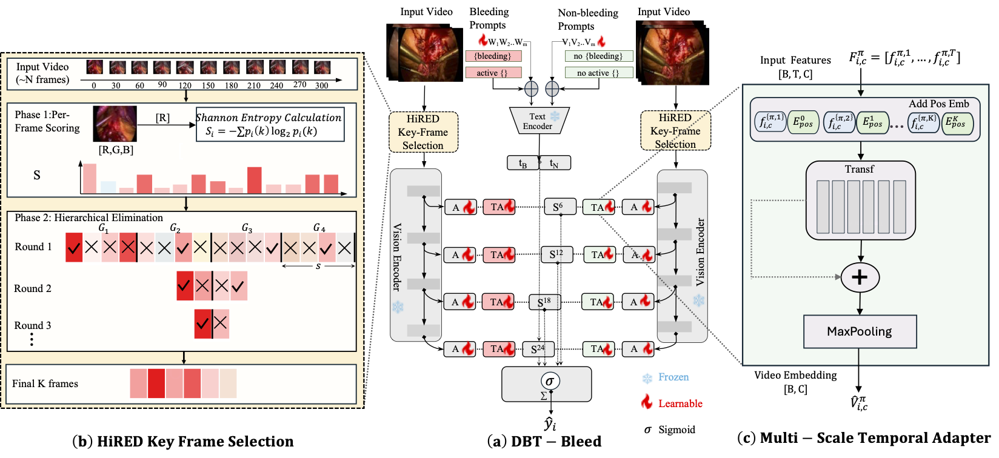

<div align="center">

# DBT-Bleed: Dual-Branch Temporal Modeling with Key-Frame Selection for Surgical Bleeding Detection

**MICCAI 2026**

Sudhanshu Mishra<sup>1*</sup>, Jialang Xu<sup>3*</sup>, Jensen Ang<sup>4</sup>, Evangelos B. Mazomenos<sup>3</sup>, Beng Ti Christopher Ang<sup>4</sup>, Yueming Jin<sup>1,2†</sup>

<sup>1</sup> Department of Electrical and Computer Engineering, National University of Singapore, Singapore<br>
<sup>2</sup> Department of Biomedical Engineering, National University of Singapore, Singapore<br>
<sup>3</sup> UCL Hawkes Institute, Department of Medical Physics and Biomedical Engineering, University College London, London, United Kingdom<br>
<sup>4</sup> Department of Neurosurgery, National Neuroscience Institute, Singapore

<sub>* Equal contribution &nbsp;·&nbsp; † Corresponding author (ymjin@nus.edu.sg)</sub>

</div>

> **Abstract.** Intraoperative Adverse Events (IAEs) detection is critical for improving surgical
> safety, with bleeding being among the most frequent events. Existing methods struggle to
> distinguish bleeding IAE from visually similar residual blood due to limited temporal reasoning,
> and modeling long surgical videos while preserving fine-grained temporal dynamics is
> computationally challenging. We propose **DBT-Bleed**, a dual-branch multi-scale temporal
> modeling framework that disentangles bleeding and normal representations using layer-wise
> temporal adapters for short- and long-term bleeding progression. To efficiently process long
> surgical videos, we introduce **HiRED**, a Hierarchical Entropy-Driven frame selection strategy
> that retains temporally informative segments while removing redundancy. On the MultiBypass
> dataset DBT-Bleed improves F1 by 6.53%, Recall by 5.62% and MCC by 9%, and demonstrates robust
> zero-shot cross-procedure transfer on **EndoPit-IAE**, a newly curated Endonasal Pituitary
> Surgery dataset — the first IAE-annotated dataset in neurosurgery.

---

<p align="center">
  
</p>

## Method

DBT-Bleed is a CLIP-based dual-branch framework with multi-scale temporal modeling. Two components are central:

- **HiRED key-frame selection** — a Hierarchical Entropy-Driven strategy that scores frames by
  red-channel Shannon entropy and iteratively prunes redundant segments, keeping the top *K*
  informative frames from each *N*-frame window.
- **Multi-scale Temporal Adapter (MTA)** — lightweight temporal transformers inserted at CLIP
  adapter depths **{6, 12, 18, 24}** to model both short- and long-range bleeding progression.

## Datasets

- **MultiBypass** (public) — laparoscopic bypass surgery videos with frame-level IAE annotations:
  [CAMMA-public/MultiBypass140](https://github.com/CAMMA-public/MultiBypass140). Used for training
  and supervised evaluation.
- **EndoPit-IAE** (in-house) — an Endonasal Pituitary Surgery dataset annotated for IAEs, used as
  an external zero-shot cross-procedure benchmark.

**Pre-processing.** Each surgical video is segmented into fixed-length clips of 300 frames with an
overlap of 100 frames, and a clip is labelled positive if any of its frames contains bleeding.

<!-- The data loader (`dataset/video_csv.py`) expects CSV manifests with columns:
`clip_path,num_frames,gt,start_frame,end_frame`. -->

## Installation

Requires Linux with a CUDA-capable NVIDIA GPU (experiments used a single 24GB RTX A5000) and conda.

```bash
conda env create -f environment.yml
conda activate dbt_bleed
```

## Configuration

Set your dataset/output paths by editing the `--csv_dir`, `--output_dir`, `--exp_name` (and
`--checkpoint` for evaluation) flags inside `scripts/train.sh` and `scripts/test.sh`. No code
changes are needed.

## Pretrained weights

1. **CLIP backbone** — download [`ViT-L-14-336px.pt`](https://openaipublic.azureedge.net/clip/models/3035c92b350959924f9f00213499208652fc7ea050643e8b385c2dac08641f02/ViT-L-14-336px.pt)
   and place it under `CLIP/ckpt/`.
2. **DBT-Bleed checkpoint** — can be downloaded
   [here](https://drive.google.com/file/d/12WVhfSmTiSsO1-oV1ODtX_n4uVzwBAg2/view?usp=sharing)
   and placed under `checkpoints/`.

## Training

```bash
bash scripts/train.sh
```

Edit the flags in `scripts/train.sh` (see [Configuration](#configuration)). Only the
lightweight adapters and learnable text prompts are optimised; the CLIP backbone stays frozen.

## Evaluation

```bash
bash scripts/test.sh
```

Edit the `--checkpoint`, `--csv_dir`, and `--output_dir` flags in `scripts/test.sh` (see
[Configuration](#configuration)); the model/sampling flags must match training.

<!--
## Repository structure

```
DBT-Bleed
├─ train.py                       # training entrypoint (video / DBT-Bleed path)
├─ test.py                        # evaluation & inference (MultiBypass + EndoPit zero-shot)
├─ loss.py                        # dual-contrast detection loss (Loss_detection)
├─ utils.py                       # text-prompt ensembling & helper transforms
├─ scripts/
│  ├─ train.sh                    # best-config training launcher
│  └─ test.sh                     # evaluation launcher (+ EndoPit zero-shot block)
├─ CLIP/                          # CLIP backbone + DBT-Bleed adapters
│  ├─ adapter_shared.py           #   dual-branch spatial adapters + Multi-scale Temporal Adapter (MTA)
│  ├─ clip.py, model.py, transformer.py, modified_resnet.py, openai.py, tokenizer.py
│  ├─ model_configs/ViT-L-14-336.json
│  └─ bpe_simple_vocab_16e6.txt.gz
├─ key_frame_selection/           # HiRED entropy-driven key-frame selection
│  ├─ entropy_segment.py          #   per-frame entropy scoring + hierarchical elimination
│  ├─ run.py
│  └─ __init__.py
├─ Prompt/                        # learnable text prompts (CoOp-style)
│  ├─ promptChooser.py
│  └─ CoOp.py
├─ dataset/
│  └─ video_csv.py                # VideoCSVDataset loader (+ HiRED sampling)
├─ images/diagram.png             # architecture figure (this README)
├─ environment.yml                # conda environment 'dbt_bleed'
├─ requirements.txt               # pip alternative
├─ README.md
└─ LICENSE

  # Created by you — not shipped (gitignored):
  CLIP/ckpt/ViT-L-14-336px.pt     # CLIP backbone weights
  checkpoints/best_ap.pth         # trained DBT-Bleed weights
  dataset/<split>/{train,val,test}.csv   # manifests
  outputs/<EXP_NAME>/             # logs, saved models & predictions written at run time
```
-->

## Citation

If you find this work useful, please cite:

```bibtex
@misc{mishra2026dbtbleeddualbranchtemporalmodeling,
      title={DBT-Bleed: Dual-Branch Temporal Modeling with Key-Frame Selection for Surgical Bleeding Detection},
      author={Sudhanshu Mishra and Jialang Xu and Jensen Ang and Evangelos B. Mazomenos and Beng Ti Ang and Yueming Jin},
      year={2026},
      eprint={2606.22829},
      archivePrefix={arXiv},
      primaryClass={cs.CV},
      url={https://arxiv.org/abs/2606.22829},
}
```

## Acknowledgements

This repository builds on [MadCLIP](https://github.com/mahshid1998/MadCLIP),
[MVFA-AD](https://github.com/MediaBrain-SJTU/MVFA-AD), and
[CoOp](https://github.com/KaiyangZhou/CoOp).

We also thank the authors of the baselines we compare against for releasing their code:
[SEDMamba](https://github.com/wzjialang/SEDMamba),
[VadCLIP](https://github.com/nwpu-zxr/VadCLIP),
[ActionCLIP](https://github.com/sallymmx/ActionCLIP), and
[MadCLIP](https://github.com/mahshid1998/MadCLIP).

## License

See [LICENSE](LICENSE).
